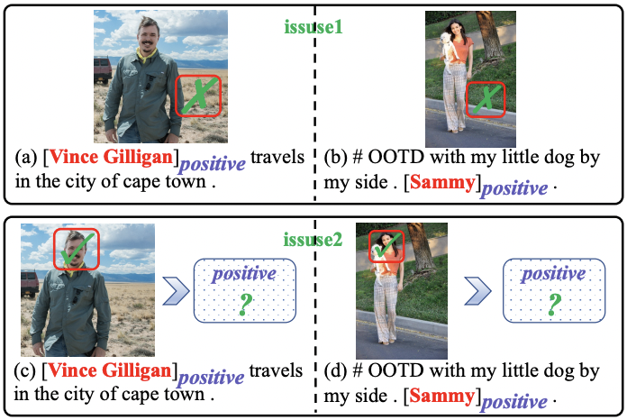

# KEF

Code and data for "[Learning from Adjective-Noun Pairs: A Knowledge-enhanced Framework for Target-Oriented Multimodal Sentiment Classification](https://aclanthology.org/2022.coling-1.590.pdf)" (COLING 2022)

## Overview



- In this paper, we propose leveraging adjective-noun pairs (ANPs) extracted from the image to help align text and image in the TMSC task.
- We propose a Knowledge-enhanced Framework (KEF), which contains a Visual Attention Enhancer to improve the effectiveness of visual attention, and a Sentiment Prediction Enhancer to reduce the difficulty of sentiment prediction.

## Dependencies

- python=3.5
- numpy=1.14.2
- tensorflow=1.9

## Usage

- Train

You can use the folowing command to train KEF on the TMSC task:

```bash
python main.py --phase="bert_train_anp" --dataset="twitter2015" --config_path="src/multimodal/config/twitter2015_config.json"
```
-  Test

You can use the folowing command to test KEF on the TMSC task:

```bash
python main.py --phase="bert_test_anp" --dataset="twitter2015" --config_path="src/multimodal/config/twitter2015_config.json"
```

## Citation
```bash
@inproceedings{zhao-etal-2022-learning-adjective,
    title = "Learning from Adjective-Noun Pairs: A Knowledge-enhanced Framework for Target-Oriented Multimodal Sentiment Classification",
    author = "Zhao, Fei  and
      Wu, Zhen  and
      Long, Siyu  and
      Dai, Xinyu  and
      Huang, Shujian  and
      Chen, Jiajun",
    booktitle = "Proceedings of the 29th International Conference on Computational Linguistics",
    month = oct,
    year = "2022",
    address = "Gyeongju, Republic of Korea",
    publisher = "International Committee on Computational Linguistics",
    url = "https://aclanthology.org/2022.coling-1.590",
    pages = "6784--6794"
}
```
If the code is used in your research, please cite our paper.

